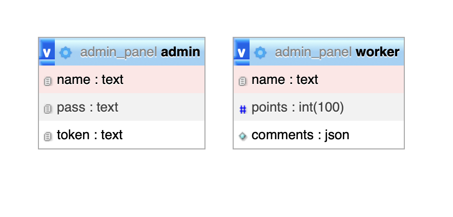

# ADM panel
#### Приложение для оценки сотрудников 👨🏻‍💻

Это веб-приложение разработанно для управления и оценки производительности сотрудников в организации. С его помощью администраторы могут оставлять комментарии и оценки по работе конкретных сотрудников, а также просматривать их профессиональный прогресс.

---
## Начало работы
 1. `npm intall` для установки всех пакетов
 2. Далее в файле `server/db.js` меняем данные для подключения к базе
```
  host: 'localhost',
  user: 'root',
  password: 'root',
  database: 'admin_panel'
```
(я использовал [MAMP](https://www.mamp.info/en/mamp/mac/) для macOs)
 3.<span style="color: red;">?</span> Возможно потребуется поменять порты в `server/server.js`
 4. Так же нам потребуется бд со списком админов (в моем случае он статичный) / и таблицей для добавления сотрудников



У админов имя и пароль статичные (не было нужды в динамике), токен каждый раз меняется при входе в систему. **Токен** используется для автоматического входа в систему с одного и того-же браузера.
 - да токен кастомный
 - да токен шифруется
 - нет токен не в localstorage, в куках доступен по httpOnly

## Вход

Страница входа


На данном этапе приложение проверит ваши куки на наличие токена, если он там есть проверит совпадает ли с тем что в базе, если не совпадет придется логиниться по новой, если все ок, перекинет на главную страницу

## Главная страница

При первом входе у вас не будет сотрудников и страница будет выглядеть так (Marat - логин админа)


## Редактирование

Есть возможность добавлять и удалять сотрудников
(нужны уникальные имена, сотрудники с одинаковыми именами будут работать не корректно)


## Главная страница (вид после добавления сотрудников)


После добавления сотрудников они находятся в произвольном порядке
(первое место - 👑 последнее место - 💩)
При клике на сотрудника мы переходим в его карточку

## Карточка сотрудника


Кликаем на оставить комментарий


Мы не сможем оставить или пустой комментарий или не выбрав оценку + или -

После успешного добавления комментария нас перенесет на главную страницу где мы увидим изменения прогрессбара, в котором сотрудники уже отфильтрованы по колл-ву набранных баллов


После повторного входа в карточку сотрудника, мы видим комментарий от админа, и когда он его оставил

